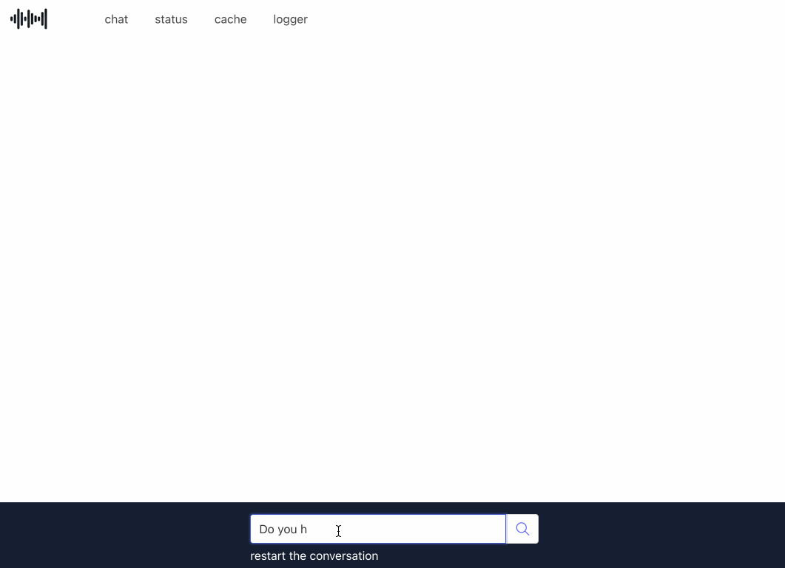

# Minipilot

This application implements a chatbot you can train with your data. From the GUI you will be able to:

- Upload CSV data
- Create an index
- Edit the system and user prompt
- Ask questions in natural language



The system uses:

- Redis Stack as a vector database to store the dataset and vectorize the content for RAG using Redis [vector search capabilities](https://redis.io/docs/latest/develop/interact/search-and-query/advanced-concepts/vectors/).
- OpenAI ChatGPT Large Language Model (LLM) [ChatCompletion API](https://platform.openai.com/docs/guides/gpt/chat-completions-api)

## Quickstart

Follow these instructions to build and start Minipilot and a Redis Stack database as containers on your laptop. For more installation methods, refer to the docs.

1. `git clone https://github.com/redis/minipilot.git`
2. `export OPENAI_API_KEY="your-openai-key"`
2. `cd minipilot`
3. `docker compose build --no-cache && docker compose up -d` and wait a couple of minutes until Redis loads the [IMDB movies dataset](https://www.kaggle.com/datasets/ashpalsingh1525/imdb-movies-dataset) in memory
4.  Point your browser to [http://127.0.0.1:5007/](http://127.0.0.1:5007), tune the prompt and start chatting
5. Browse your data with Redis Insight at [http://127.0.0.1:8099](http://127.0.0.1:8099)

## Troubleshooting

For troubleshooting, you can copy the execution log from the container to the host.

```commandline
docker cp minipilot:/app/gunicorn.log .
```

Note that if your OpenAI key is not valid or expired, restart the Minipilot container (or rebuild it).

## Documentation
- [Installation Guide](docs/installation.md)
- [Usage Guide](docs/usage.md)
- [API Documentation](docs/api.md)
- [Architecture Overview](docs/architecture.md)
- [FAQ](docs/faq.md)


