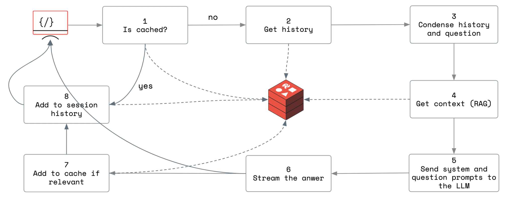

## Architecture

The standard data pipeline is illustrated by the diagram.

The explanation of the steps in the pipeline follows.

1. Minipilot leverages [RedisVL](https://redis.io/docs/latest/integrate/redisvl/) to introduce the [semantic cache](https://redis.io/docs/latest/integrate/redisvl/user-guide/semantic-caching/) to the project. The vectorizer is the OpenAI's [embedding model](https://platform.openai.com/docs/guides/embeddings/embedding-models) `text-embedding-ada-002`.
2. The history is collected from Redis. It is stored as a Redis list keyed by the user session identifier.
3. The conversation history and the last question are condensed into a standalone question, which retrieves a conversation-aware context from Redis with a vector search.
4. The context is collected with a range vector search based on the desired threshold and the number of results. Both are configurable (search for `MINIPILOT_CONTEXT_LENGTH` and `MINIPILOT_CONTEXT_RELEVANCE_SCORE`)
5. The history, the context, and the question are assembled in the prompt. The system prompt, together with the assembled prompts, is passed to the LLM. The whole operation is done using LangChain’s [ConversationalRetrievalChain](https://api.python.langchain.com/en/latest/chains/langchain.chains.conversational_retrieval.base.ConversationalRetrievalChain.html) API.
6. The answer is streamed back to the user.
7. The question and answer pair is added to the cache if relevant (a basic criterion is represented by the context. If there was at least a result while fetching the context for RAG, then the question is pertinent, and the answer can be saved).
8. The interaction is added to the conversation history.
